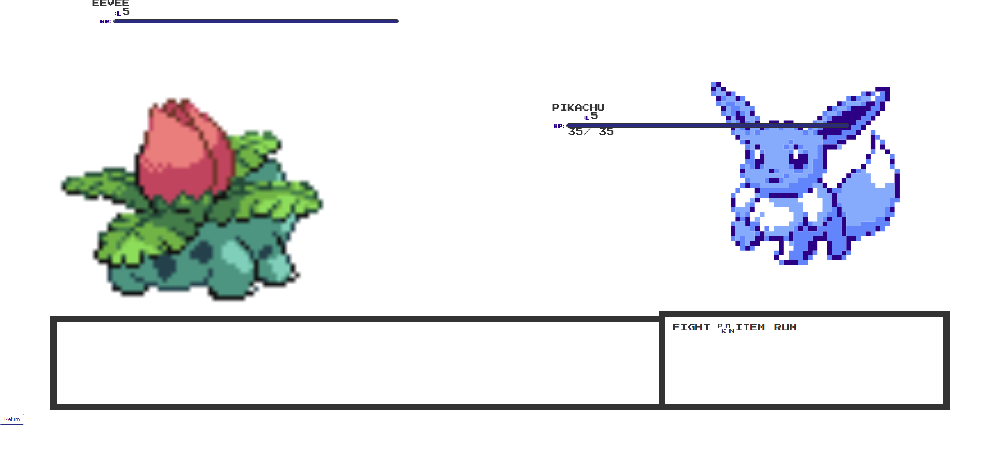

<!-- @format -->

# Pokemon Yellow Online

## Description

This is a pokemon selection and battle site that uses pokeApi, Javascript, CSS, local storage and HTML.

## Table of Contents

- [Description](#description)
- [Installation](#installation)
- [Usage](#usage)
- [Deployed Application](#deployed-application)
- [Screenshot](#screenshot)
- [License](#license)

## Installation

No installation required. You can access the application by clicking on the following link: [Pokemon Online](https://github.com/calvinyueWillTry/Project_1_Group)x

## Usage

To use the application, click on the link provided in the installation section. Once the application is open, click on the "Generate Password" button. You will be prompted to enter the length of the password you would like to generate. You will then be prompted to select the criteria for the password. You can choose to include lowercase letters, uppercase letters, numbers, and special characters. Once you have selected the criteria, the password will be generated and displayed on the screen.

## Deployed Application

The deployed application can be accessed by clicking on the following link: [Pokemon Online](https://calvinyuewilltry.github.io/Project_1_Group/)

## Screenshot

## License

MIT License

## HTML
Mainpage: We start with the head, and then the links that we are using for everything, from fonts to CSS. At the top of the page, we added links to the Battle and Pokemon selection pages (the pokeball). 

Then there's the title in the header, along with links in the navigation bar, as well as the audio in an autoplay loop. We also added the links to the API links that we used for this project as "resources and credits." 

At the footer of the page is a link to our Github page, and a link to change to the Pokemon selection page, as well as sourcing the JS page for this.

Pokemon Selection Page: We start with the title in the header, and that's followed by having the "pokemon-list" and "pok-img" to get the Pokemon pictures from the API (in the JS). Then the list of hard-coded spots for allowing the Pokemon to appear on the page are below. 

Every spot for the Pokemon is also hard-coded with an element for the 
 section,  A place on the page for the image, name and description. Because it's an array, the array is also hard-coded, albeit from 1-20 instead of 0-19. 
At the footer, There are buttons to either navigate to the battle page, or return to the homepage.

